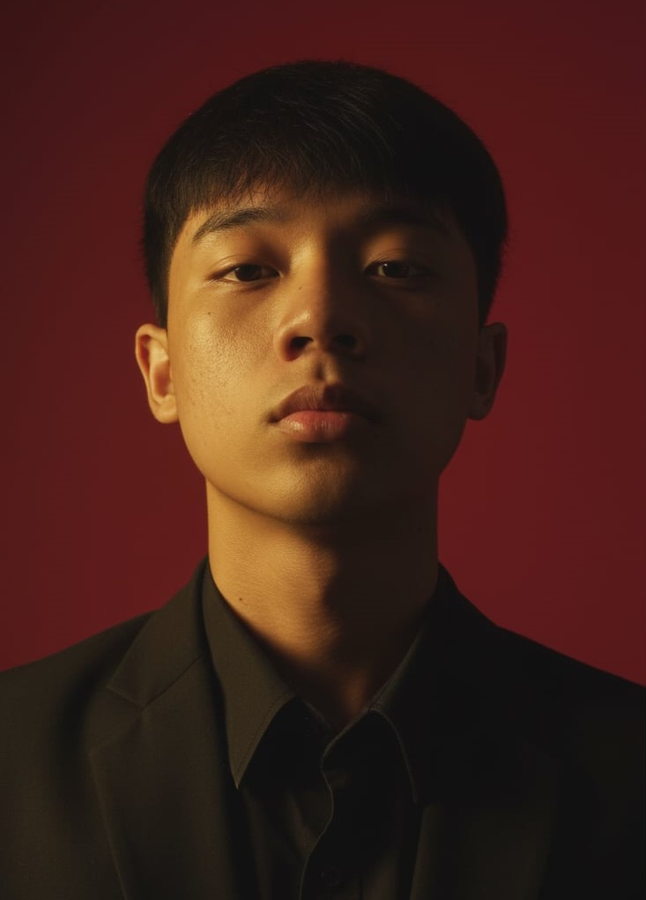

    

---
 

    

<h1 align="center" style="color:#00FFFF; text-shadow: 0 0 5px #00FFFF, 0 0 10px #A020F0;">
    
</h1>

<h2 align="center" style="color:#A020F0; text-shadow: 0 0 3px #A020F0;">
    Hello! I'm Kurt 👋
</h2>

Welcome to my Object-Oriented Programming Portfolio!. This repository acts as a digital log of my OOP Lab exercises, emphasizing the principles I've learned and applied to various challenges and projects.
This will reflect my progress and understanding throughout the subject.

---

## 💾 ABOUT ME

I am a Computer Science student in City College of Angeles, focused on systems and logic. I enthusiastically pursue what captures my interest, maintaining a positive, simple, and quiet approach to my work.

<h3 style="color:#A020F0; text-shadow: 0 0 3px #A020F0;">:: Core Directives</h3>
<ul style="color:#ADD8E6;">
    <li>Life is not a race, Don't rush, there is always a time for every moment 👌</li>
    <li>Failing is part of the process, so trust the process and evaluate progress. 📈</li>
    <li>Always be Resilient, Life is tough. 💪</li>
</ul>

The key to success is by ***always learning and improving***, maintaining balance in your life, and always grabbing every opportunity that comes right in front of your door.

---

## 🎓 ACADEMIC

<h4 style="color:#00FFFF;">Senior Highschool: <em style="color:#ADD8E6;">Angeles City National Trade School (CSS Strand)</em> 👨‍💻</h4>
<h4 style="color:#00FFFF;">Junior Highschool: <em style="color:#ADD8E6;">Angeles City National Trade School</em></h4>
<h4 style="color:#00FFFF;">Elementary: <em style="color:#ADD8E6;">Sto. Rosario Elementary School</em></h4>

---

## ⌨️ PROGRAMMING LANGUAGES

&nbsp;&nbsp;

&nbsp;&nbsp;

&nbsp;&nbsp;

---

## 💻 MY PROJECTS

<h3 style="color:#A020F0; text-shadow: 0 0 3px #A020F0;">:: Midterm Assignments</h3>
<ul style="color:#ADD8E6;">
    <li><strong style="color:#00FFFF;">MIDTERM LAB TASK 1:</strong> <a href="https://github.com/Justine-Kurt-Torres/7OOP-Lab-Task/blob/main/MidtermLabTask1.pdf" style="color:#ADD8E6; text-shadow: 0 0 1px #8A2BE2;">[📂 Paired Task]</a></li>
    <li><strong style="color:#00FFFF;">MIDTERM LAB TASK 2:</strong> <a href="https://github.com/Justine-Kurt-Torres/7OOP-Lab-Task/blob/main/MidtermLabTask2.pdf" style="color:#ADD8E6; text-shadow: 0 0 1px #8A2BE2;">[📂 Using Loops and Functions]</a></li>
    <li><strong style="color:#00FFFF;">MIDTERM LAB TASK 3:</strong> <a href="https://github.com/Justine-Kurt-Torres/7OOP-Lab-Task/blob/main/MidtermLabTask3.pdf" style="color:#ADD8E6; text-shadow: 0 0 1px #8A2BE2;">[📂 Using List Collection Types]</a></li>
    <li><strong style="color:#00FFFF;">MIDTERM LAB TASK 4:</strong> <a href="https://github.com/Justine-Kurt-Torres/7OOP-Lab-Task/blob/main/MidtermLabTask4.pdf" style="color:#ADD8E6; text-shadow: 0 0 1px #8A2BE2;">[📂 Using Dictionaries]</a></li>
    <li><strong style="color:#00FFFF;">MIDTERM LAB TASK 5:</strong> <a href="https://github.com/Justine-Kurt-Torres/7OOP-Lab-Task/blob/main/MidtermLabTask5.pdf" style="color:#ADD8E6; text-shadow: 0 0 1px #8A2BE2;">[📂 Creating Class and Instantiating Objects in Python]</a></li>
</ul>

<h3 style="color:#A020F0; text-shadow: 0 0 3px #A020F0;">:: Finals Assignments</h3>
<ul style="color:#ADD8E6;">
    <li><strong style="color:#00FFFF;">FINALS LAB TASK 1:</strong> <a href="https://github.com/Justine-Kurt-Torres/7OOP-Lab-Task/blob/main/FinalsLabTask1.pdf" style="color:#ADD8E6; text-shadow: 0 0 1px #8A2BE2;">[📂 *A Car that Works (Encapsulation)*]</a></li>
</ul>

---

## 🤩 FUN FACTS

<ul style="color:#ADD8E6;">
    <li>I love listening to music 🎧</li>
    <li>I'm interested in various online mobile games 🎮</li>
    <li>I'm interested in martial arts too 💪</li>
    <li>Sometimes I'm quiet and sometimes noisy too 😆</li>
    <li>Sometimes I get distracted easily on online while watching video tutorials 😅</li>
</ul>

---

## 📌 SKILL TREE

<ul style="color:#ADD8E6;">
    <li><strong style="color:#00FFFF;">Time Management</strong> 🕰️</li>
    <li><strong style="color:#00FFFF;">Adaptability</strong> 🔄</li>
    <li><strong style="color:#00FFFF;">Positive Attitude</strong> 😊</li>
    <li><strong style="color:#00FFFF;">Active Listener</strong> 👂</li>
</ul>

---

## 📞 CONTACTS

    
    &nbsp;&nbsp;
    

